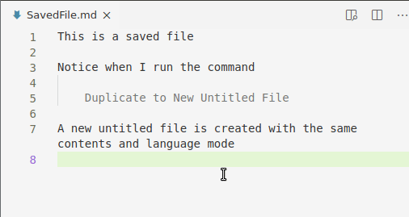

# Duplicate to Untitled File

Provides commands to duplicate the contents of an editor to a new untitled file

## Features

- `Duplicate to New Untitled File`: Duplicates the contents of the active editor in a new untitled/unsaved file.

- `Replace with Duplicated New Untitled File`: Same, but also close the active editor
